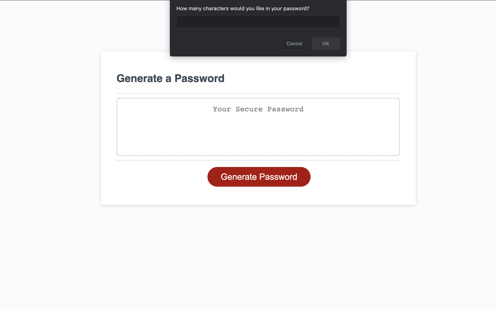

# module-3-password-generator

## Overview

To create strong passwords that have greater security, I created an application that creates passwords for me provided certain criterias.

The application asks for the length of the password between 8-128 characters.

The application confirms if I would like to include the characters below:

- Uppercase Characters
- Lowercase Characters
- Numeric Characters
- Special Characters

I learned how to incorporate .concat and Math.random to combine and randomize selected characters

## Installation:

1. `git clone git@github.com:PDKetchum/module-3-password-generator.git`
2. Open `index.html`

Hosted: https://pdketchum.github.io/module-3-password-generator/

GitHub URL: https://github.com/PDKetchum/module-3-password-generator

_Screenshot of page_
